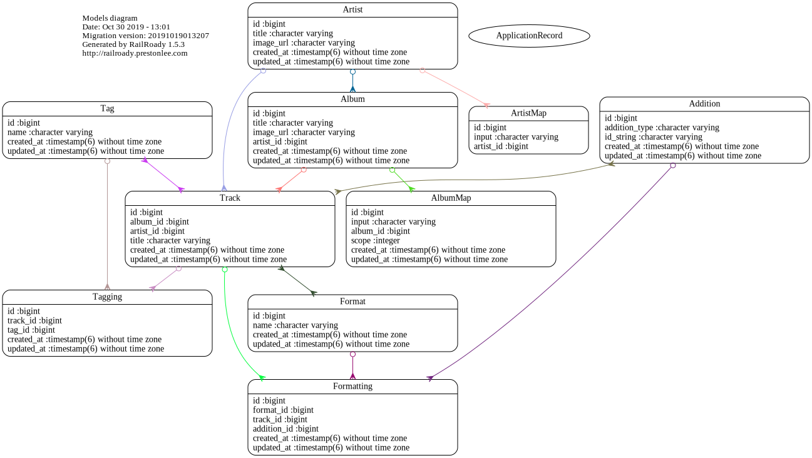

# Mino API

This is the backend for my final project, Mino. It is built with Ruby on Rails 6. The frontend for the app is built with React and Sass and can be found at [mino-client](https://github.com/jivison/mino-client).

## Running the app yourself
If you wish to run the app yourself, simply fill in your api credentials into [api_keys.example](config/initializers/apikeys.example), and rename it with a `.rb` ending.

*Remember to not commit those keys/secrets to Github!*

## Structure
The external API wrappers can be found under `/lib`.

ERD Generated by railroady:

This rails project was set up in API mode and returns only JSON. 
